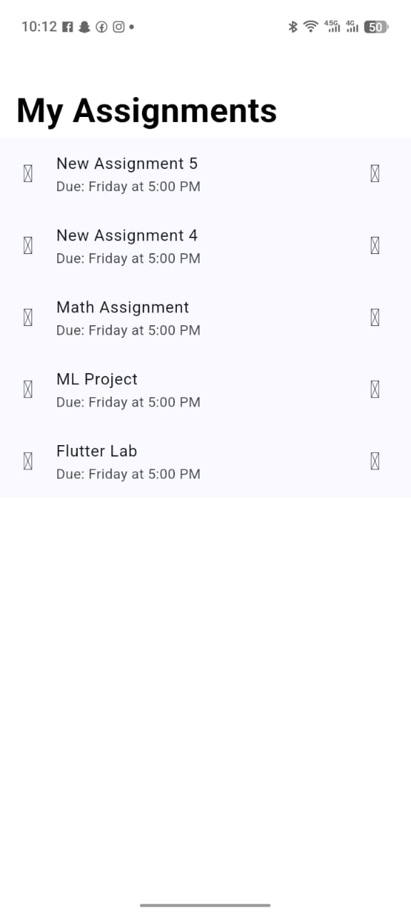

# CupertinoSliverRefreshControl Demo

A simple pull-to-refresh demo using Flutter's iOS-style refresh widget to load new assignments.

Presentation Date: 25th February 2025

## What It Does

This app demonstrates the CupertinoSliverRefreshControl widget through a realistic scenario: a student pulling down their assignment list to check for new assignments. Pull down on the list and watch as a new assignment appears at the top after a brief loading animation.


## How to Run

1. Clone this repo:
   ```bash
   git clone <your-repo-url>
   cd flutter_cupertino_refresh
   ```

2. Get the dependencies:
   ```bash
   flutter pub get
   ```

3. Run the app:
   ```bash
   flutter run
   ```

## Three Key Attributes

## 1. refreshTriggerPullDistance
- What it is: The distance (in pixels) you need to pull down before the refresh actually kicks in.
- Default value: 100.0
- Why change it? If you want users to pull further (or less far) before triggering the refresh. A larger value makes the gesture more deliberate; a smaller value makes it more sensitive.

## 2. refreshIndicatorExtent
- What it is: The height of the area where the spinning refresh indicator lives while loading.
- Default value: 60.0
- Why change it? Adjusting this changes how much vertical space the spinner takes up. Useful if you want a more compact or more prominent loading indicator.

## 3. onRefresh
- What it is: A callback function (type `Future<void> Function()`) that runs when the user pulls to refresh.
- What it does: This is where you put your actual refresh logic—fetching new data, hitting an API, updating the UI, etc.
- Why it matters: Without this, nothing happens when you pull! It's the brain of the widget.

---

## Screenshot



_The app shows a list of assignments with a Cupertino-style navigation bar. Pull down to refresh and see a new assignment appear._


## Notes

- This widget must be used inside a `CustomScrollView` with slivers.
- The demo simulates a 2-second network delay using `Future.delayed()` to make the refresh feel realistic.
- Code structure inspired by Flutter's official Cupertino documentation.


Widget Presented: CupertinoSliverRefreshControl

